# Port Intelligence Platform — Entity Relationship Diagram

Full ERD generated from the live PostgreSQL schema (`port_intel`), including all 49 Foreign Key relationships.

```mermaid
classDiagram
direction BT
class berth_occupancy {
    occupancy_id
    berth_id
    port_call_id
    occupied_from
    occupied_until
}
class berths {
    berth_id
    port_id
    berth_code
    berth_name
    location
    max_draft_meters
    max_loa_meters
    max_dwt_tonnes
    supports_dangerous_goods
    supports_reefer_containers
    supports_ro_ro
    has_shore_power
    crane_capacity_tonnes
    is_active
    notes
    created_at
    updated_at
}
class cargo_manifests {
    cargo_id
    nomination_id
    port_call_id
    cargo_description
    cargo_quantity
    cargo_unit
    imdg_hazard_class
    un_number
    requires_refrigeration
    target_temperature_celsius
    is_perishable
    origin_country_id
    destination_country_id
    created_at
}
class classification_societies {
    society_id
    society_name
    is_iacs_member
    country_id
    created_at
}
class companies {
    company_id
    imo_company_number
    company_name
    country_id
    registered_address
    primary_contact_name
    primary_contact_email
    primary_contact_phone
    ownership_transparency_flag
    is_sanctioned
    notes
    created_at
    updated_at
}
class company_contacts {
    contact_id
    company_id
    first_name
    last_name
    job_title
    email
    phone
    is_primary_for_nominations
    notes
    created_at
    updated_at
}
class countries {
    country_id
    iso_alpha2
    iso_alpha3
    country_name
    paris_mou_flag_tier
    is_eu_member
    is_sanctioned_jurisdiction
    created_at
    updated_at
}
class currencies {
    currency_code
    currency_name
    minor_unit
}
class generated_documents {
    document_id
    nomination_id
    port_call_id
    document_type
    status
    version_number
    file_url
    file_hash_sha256
    generated_by
    generated_at
    sent_at
    sent_to_email
    acknowledged_at
    acknowledged_by
    rejection_reason
    supersedes_document_id
    created_at
}
class geography_columns {
    f_table_catalog
    f_table_schema
    f_table_name
    f_geography_column
    coord_dimension
    srid
    type
}
class geometry_columns {
    f_table_catalog
    f_table_schema
    f_table_name
    f_geometry_column
    coord_dimension
    srid
    type
}
class nomination_unstructured_notes {
    note_id
    nomination_id
    note_text
    extracted_by
    confidence_score
    requires_human_review
    reviewed_at
    reviewed_by
    created_at
}
class nominations {
    nomination_id
    vessel_id
    nominating_company_id
    nominating_contact_id
    destination_port_id
    status
    eta
    etd
    requested_berth_id
    assigned_berth_id
    source_email_subject
    source_email_body_raw
    source_email_received_at
    source_email_sender_address
    llm_extraction_metadata
    assigned_agent_name
    mentor_contact_note
    created_at
    updated_at
}
class port_calls {
    port_call_id
    vessel_id
    port_id
    nomination_id
    berth_id
    status
    eta
    actual_arrival_time
    actual_berthing_time
    actual_departure_time
    draft_on_arrival_meters
    purpose_of_call
    created_at
    updated_at
}
class port_service_orders {
    service_order_id
    port_call_id
    service_type
    provider_company_id
    status
    requested_at
    scheduled_for
    completed_at
    cost_amount
    cost_currency
    notes
    created_at
    updated_at
}
class port_weather_history {
    weather_record_id
    port_id
    recorded_at
    wind_speed_knots
    wind_direction_degrees
    wave_height_meters
    air_temperature_celsius
    water_temperature_celsius
    visibility_meters
    ice_present
    ice_thickness_cm
    data_source
    raw_payload
    created_at
}
class ports {
    port_id
    un_locode
    port_name
    country_id
    location
    timezone
    max_draft_meters
    max_loa_meters
    max_beam_meters
    has_icebreaker_support
    has_cold_storage_facility
    is_isps_compliant
    port_authority_name
    port_authority_contact_email
    port_authority_contact_phone
    notes
    is_active
    created_at
    updated_at
}
class psc_deficiencies {
    deficiency_id
    inspection_id
    deficiency_code
    deficiency_description
    severity
    action_taken
    created_at
}
class psc_inspections {
    inspection_id
    vessel_id
    inspecting_port_id
    inspecting_authority
    inspection_date
    deficiency_count
    was_detained
    detention_days
    inspection_report_url
    notes
    created_at
}
class risk_factor_definitions {
    factor_id
    factor_category
    factor_code
    factor_label
    description
    weight
    max_score_contribution
    is_active
    applicable_port_id
    created_at
    updated_at
}
class sanctions_screening_results {
    screening_id
    vessel_id
    company_id
    list_source
    screening_result
    matched_entry_name
    match_confidence_pct
    screened_at
    reviewed_by_user
    review_notes
}
class spatial_ref_sys {
    srid
    auth_name
    auth_srid
    srtext
    proj4text
}
class v_berth_availability {
    berth_id
    port_name
    berth_code
    berth_name
    max_draft_meters
    max_loa_meters
    supports_dangerous_goods
    supports_reefer_containers
    occupied_from
    occupied_until
    currently_free
}
class v_nomination_summary {
    nomination_id
    status
    imo_number
    current_vessel_name
    nominating_company
    destination_port
    eta
    etd
    assigned_berth
    overall_risk_score
    risk_tier
    created_at
}
class v_vessel_certificates_status {
    certificate_id
    vessel_id
    certificate_type
    certificate_number
    issuing_authority
    issue_date
    expiry_date
    is_valid
    document_file_url
}
class v_vessel_current_risk {
    vessel_id
    imo_number
    current_vessel_name
    domain
    type_family
    flag_country
    paris_mou_flag_tier
    overall_risk_score
    risk_tier
    assessed_at
    assessment_trigger
}
class vessel_certificates {
    certificate_id
    vessel_id
    certificate_type
    certificate_number
    issuing_authority
    issue_date
    expiry_date
    document_file_url
    created_at
    updated_at
}
class vessel_company_roles {
    role_id
    vessel_id
    company_id
    role_type
    effective_from
    effective_until
    is_current
    created_at
}
class vessel_name_history {
    name_history_id
    vessel_id
    vessel_name
    flag_country_id
    effective_from
    effective_until
    source
    created_at
}
class vessel_risk_assessment_factors {
    assessment_factor_id
    assessment_id
    factor_id
    factor_value_observed
    score_contribution
    created_at
}
class vessel_risk_assessments {
    assessment_id
    vessel_id
    nomination_id
    port_call_id
    assessed_at
    overall_risk_score
    risk_tier
    model_version
    assessment_trigger
    assessed_by
    is_current
    notes
    created_at
}
class vessel_technical_specs {
    spec_id
    vessel_id
    length_overall_meters
    beam_meters
    draft_meters
    air_draft_meters
    gross_tonnage
    net_tonnage
    deadweight_tonnage
    main_engine_power_kw
    max_speed_knots
    has_ice_class
    ice_class_designation
    container_capacity_teu
    has_reefer_plugs
    reefer_plug_count
    effective_from
    effective_until
    data_source
    created_at
}
class vessel_type_reference {
    vessel_type_id
    type_family
    ais_category
    ais_numeric_code
    statcode5_label
    type_description
    typical_risk_baseline
    requires_icebreaker_priority
    created_at
}
class vessels {
    vessel_id
    imo_number
    mmsi
    call_sign
    current_vessel_name
    domain
    vessel_type_id
    flag_country_id
    year_built
    classification_society_id
    is_active
    scrapped_date
    notes
    created_at
    updated_at
}

%% ============================================================================
%% RELACJE (Foreign Keys) - dopisane recznie, Mermaid nie eksportuje ich z DataGrip
%% Notacja: TabelaZRodzica "1" --> "0..N" TabelaZDziecmi : kolumna_fk
%% ============================================================================
berths "1" --> "0..N" berth_occupancy : berth_id
port_calls "1" --> "0..N" berth_occupancy : port_call_id
ports "1" --> "0..N" berths : port_id
countries "1" --> "0..N" cargo_manifests : destination_country_id
nominations "1" --> "0..N" cargo_manifests : nomination_id
countries "1" --> "0..N" cargo_manifests : origin_country_id
port_calls "1" --> "0..N" cargo_manifests : port_call_id
countries "1" --> "0..N" classification_societies : country_id
countries "1" --> "0..N" companies : country_id
companies "1" --> "0..N" company_contacts : company_id
nominations "1" --> "0..N" generated_documents : nomination_id
port_calls "1" --> "0..N" generated_documents : port_call_id
generated_documents "1" --> "0..N" generated_documents : supersedes_document_id
nominations "1" --> "0..N" nomination_unstructured_notes : nomination_id
berths "1" --> "0..N" nominations : assigned_berth_id
ports "1" --> "0..N" nominations : destination_port_id
companies "1" --> "0..N" nominations : nominating_company_id
company_contacts "1" --> "0..N" nominations : nominating_contact_id
berths "1" --> "0..N" nominations : requested_berth_id
vessels "1" --> "0..N" nominations : vessel_id
berths "1" --> "0..N" port_calls : berth_id
nominations "1" --> "0..N" port_calls : nomination_id
ports "1" --> "0..N" port_calls : port_id
vessels "1" --> "0..N" port_calls : vessel_id
currencies "1" --> "0..N" port_service_orders : cost_currency
port_calls "1" --> "0..N" port_service_orders : port_call_id
companies "1" --> "0..N" port_service_orders : provider_company_id
ports "1" --> "0..N" port_weather_history : port_id
countries "1" --> "0..N" ports : country_id
psc_inspections "1" --> "0..N" psc_deficiencies : inspection_id
ports "1" --> "0..N" psc_inspections : inspecting_port_id
vessels "1" --> "0..N" psc_inspections : vessel_id
ports "1" --> "0..N" risk_factor_definitions : applicable_port_id
companies "1" --> "0..N" sanctions_screening_results : company_id
vessels "1" --> "0..N" sanctions_screening_results : vessel_id
vessels "1" --> "0..N" vessel_certificates : vessel_id
companies "1" --> "0..N" vessel_company_roles : company_id
vessels "1" --> "0..N" vessel_company_roles : vessel_id
countries "1" --> "0..N" vessel_name_history : flag_country_id
vessels "1" --> "0..N" vessel_name_history : vessel_id
vessel_risk_assessments "1" --> "0..N" vessel_risk_assessment_factors : assessment_id
risk_factor_definitions "1" --> "0..N" vessel_risk_assessment_factors : factor_id
nominations "1" --> "0..N" vessel_risk_assessments : nomination_id
port_calls "1" --> "0..N" vessel_risk_assessments : port_call_id
vessels "1" --> "0..N" vessel_risk_assessments : vessel_id
vessels "1" --> "0..N" vessel_technical_specs : vessel_id
classification_societies "1" --> "0..N" vessels : classification_society_id
countries "1" --> "0..N" vessels : flag_country_id
vessel_type_reference "1" --> "0..N" vessels : vessel_type_id
```

Tables with no connecting lines (`spatial_ref_sys`, `geometry_columns`, `geography_columns`) are PostGIS system tables, not part of the business model. Views (`v_*`) have no FK constraints of their own, so they also appear unconnected — that's expected.